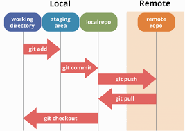
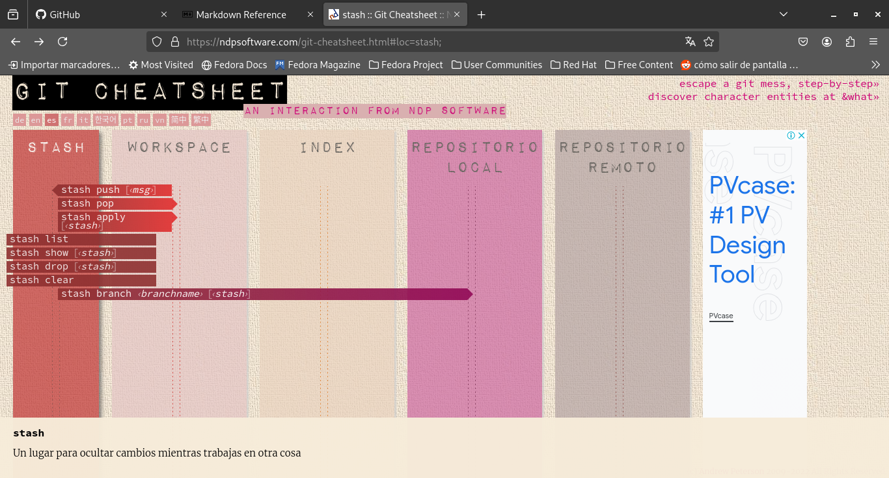
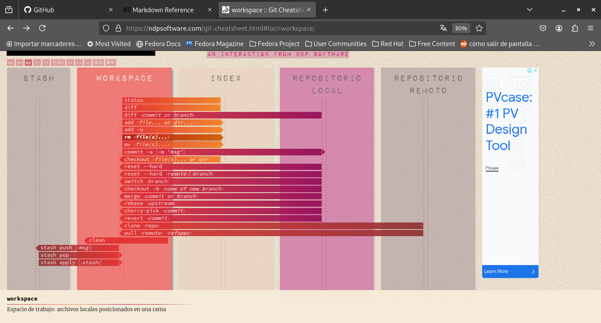
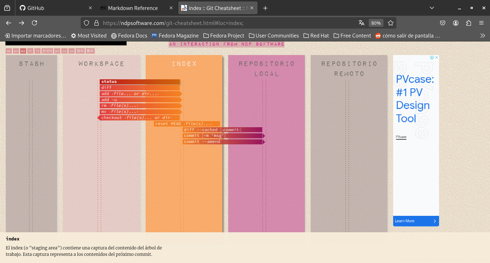
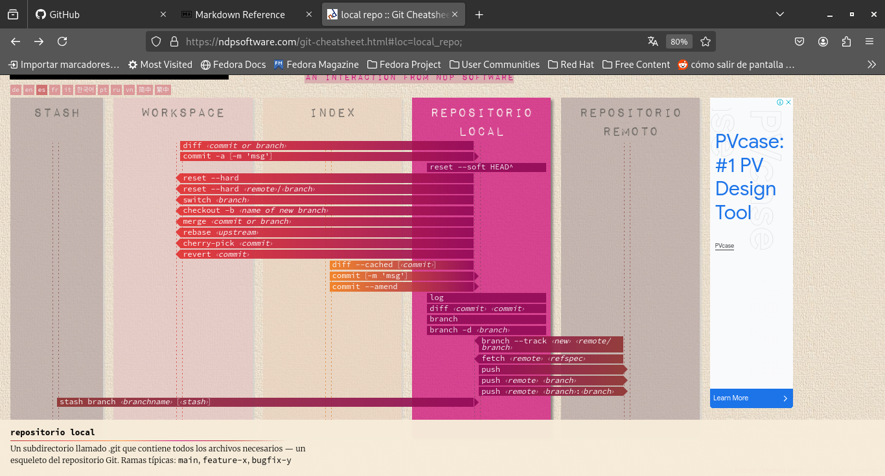
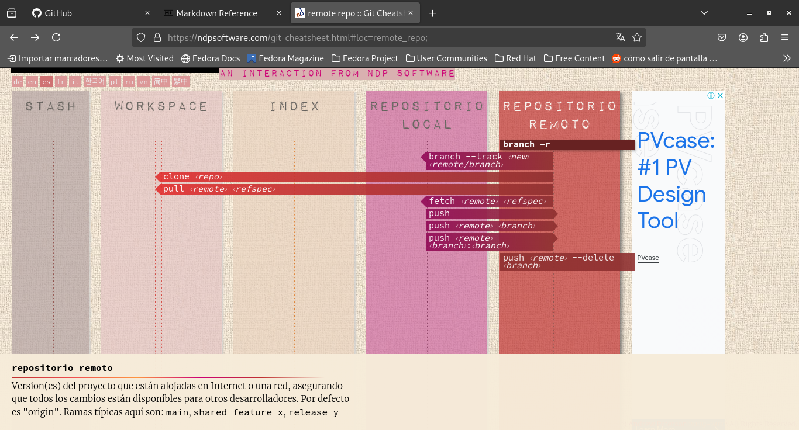

# Git y GitHub Practicas

> Repositorio en donde me enfoco a aprender a usar los comandos de git basicos desde la terminal de linux o windows. Junto con GitHub como plataforma de gestión de software en la nube o en remoto.

## Ejemplos del flujo de trabajo con Git y GitHub:

- ### Basic example:

- ### Stash area:

- ### Workspace area:

- ### Index or staging area:

- ### Local repository:

- ### Remote repository:

## Refencias:

- [Git Refences](https://git-scm.com/docs)

- [Visual Git Cheat Sheet](https://ndpsoftware.com/git-cheatsheet.html#loc=index;)

- [Curso de Git y GitHub desde cero para principiantes](https://youtu.be/3GymExBkKjE?si=1ixWTqAsNBuR9_NQ) por MoureDev

- [Curso de Git y GitHub para aportar a proyectos](https://youtu.be/niPExbK8lSw?si=pifH2Foj7i82Dnll) por Midulive

- [Markdown reference](https://commonmark.org/help/)

- [Markdown Guide](https://www.markdownguide.org/basic-syntax/)